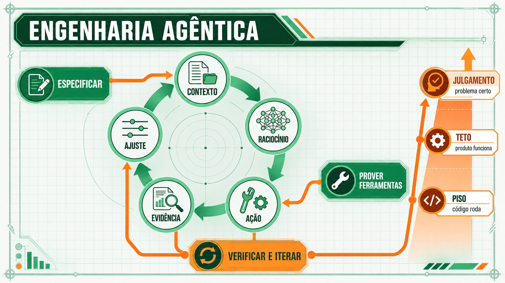

# Conceitos

## Três modos de trabalho que a maioria dos times mistura num só

Três modos de trabalho com IA se destacam na prática atual de desenvolvimento de software:

| Modo | Artefato que governa | Como a qualidade é julgada | Risco dominante |
|---|---|---|---|
| Vibe coding | conversa corrente e resultado aparente | "parece funcionar" | intenção implícita, regressão, dívida invisível |
| Assistência de codificação | ticket, código existente, revisão do desenvolvedor | testes e revisão depois de gerar | contexto fragmentado, decisões não registradas |
| SDD (Sessão 8) | constitution, spec, plano, tarefas, testes e gates versionados | rastreabilidade entre intenção, implementação e evidência | custo de especificar sem manter os artefatos vivos |

Este workshop move o time da primeira linha para a terceira ao longo de dez sessões: assistência de codificação disciplinada do Bloco 2 ao Bloco 3, SDD completo na Sessão 8.

## De onde vem o vibe coding

O termo vem de Andrej Karpathy, pesquisador fundador da OpenAI e ex-diretor de IA da Tesla, numa publicação de fevereiro de 2025. O motivo técnico para essa prática funcionar já existia antes do nome: Brown et al. demonstraram, no artigo que apresentou o GPT-3, que um modelo de linguagem executa uma tarefa nova a partir só da descrição em linguagem natural e de alguns exemplos no próprio texto de entrada, sem qualquer ajuste de peso. Esse mecanismo, chamado aprendizado em contexto, é o que torna um prompt capaz de funcionar como programa.

Simon Willison, que documenta práticas de desenvolvimento assistido por IA desde 2022, é específico sobre onde o uso legítimo do vibe coding termina: "vibe coding is more useful in its original definition — we need a term to describe unreviewed, prototype-quality LLM-generated code". Serve para prototipagem descartável. O problema aparece quando o time atravessa, sem perceber, a fronteira entre protótipo e produto: a conversa carrega decisões que nunca chegam ao repositório, o teste confirma só o que foi implementado, e a próxima sessão do agente não herda o raciocínio da anterior.

O próprio Karpathy documentou o limite na prática: os ganhos de velocidade do vibe coding "vanished shortly after getting local code running". A aceleração desaparece quando o código precisa integrar, ser mantido, ou sobreviver a um caso de borda fora do que o prompt original previu.

## A evidência empírica: ganhos que aparecem e ganhos que desaparecem

A frase de Karpathy tem confirmação empírica, e ela é mais desconfortável do que a frase sozinha sugere. Peng et al. (2023) conduziram um experimento randomizado com 70 desenvolvedores profissionais implementando um servidor HTTP em JavaScript: o grupo com GitHub Copilot terminou a tarefa em 71 minutos contra 161 minutos do grupo de controle, um ganho de 55,8%. O efeito foi maior justamente para desenvolvedores menos experientes.

O METR, em 2025, testou uma situação diferente: 16 desenvolvedores experientes, cada um com cerca de cinco anos de trajetória nos próprios projetos open source maduros, resolvendo 246 tarefas reais de manutenção. O resultado inverteu a expectativa: usar IA tornou a conclusão das tarefas 19% mais lenta. Mais revelador ainda, os próprios desenvolvedores, depois de terminar, estimaram que a IA os havia deixado 20% mais rápidos — o oposto exato do que os dados mediram.

A contradição entre os dois estudos não invalida nenhum dos dois. Ela aponta a variável que mais importa: tarefa nova e bem delimitada versus manutenção de um sistema grande que o desenvolvedor já conhece de cor. O ganho de piso do Bloco seguinte aparece rápido no primeiro caso; no segundo, sem disciplina, o tempo gasto revisando e corrigindo a proposta do agente supera o tempo que teria sido gasto escrevendo o código direto.

### Os três sintomas do time que ainda não saiu da primeira linha

- **Inconsistente.** Alguns desenvolvedores extraem resultados excelentes do mesmo modelo que outros usam apenas como um completador de código sofisticado. A causa está em como cada um pede ao modelo.
- **Sem rede.** Código é aceito sem que quem aceitou entenda de fato o que ele faz. Pearce et al. (2022), em um estudo hoje seminal, submeteram o GitHub Copilot a 89 cenários de programação cobrindo as principais categorias de vulnerabilidade (CWE Top 25) e encontraram falha de segurança em cerca de 40% dos programas gerados. Quando esse código quebra ou é explorado em produção, não há protocolo de depuração, só tentativa e erro.
- **Ad hoc.** Não existe fluxo, vocabulário ou critério de aceitação compartilhado entre o time para o que "um bom pedido à IA" significa.

!!! question "Antes de continuar"
    Qual desses três sintomas apareceu no seu time na última semana? Pense num exemplo concreto, sem apontar culpados: o objetivo é reconhecer o padrão coletivo.

## A tese do Software 3.0

A arquitetura Transformer, descrita por Vaswani et al. em 2017, é a base técnica de todo LLM usado hoje em ferramentas agênticas de codificação. Ela é o que torna prática a aprendizagem em contexto descrita acima, e é sobre essa maturidade técnica que Karpathy constrói uma tese de fundo, apresentada na YC AI Startup School de 17 de junho de 2025.

A tese não nasceu isolada. Em 2017, no mesmo ano do artigo de Vaswani et al., Karpathy já havia publicado o ensaio "Software 2.0", propondo que uma rede neural treinada é um tipo de programa diferente: em vez de escrito à mão em Python ou C++, ele é compilado a partir de dados por um processo de otimização. Software 3.0 estende essa mesma lógica um passo adiante — a programação teve, ao longo da história, um paradigma dominante por vez, e agora tem três coexistindo.

**Software 1.0** é código explícito, escrito por humanos em linguagens de programação. **Software 2.0** são redes neurais: em vez de código, o time ajusta pesos por treinamento. **Software 3.0** é o prompt em linguagem natural funcionando como o próprio programa, interpretado por um LLM. Karpathy resume a virada numa frase que já circula como definição: "the hottest new programming language is English."

O prompt deixa de ser um pedido informal para um assistente e passa a ser a especificação executável. Tecnicamente, o que o LLM processa em cada execução é limitado pela **janela de contexto**: o limite de unidades de entrada e saída que o modelo consegue considerar. Convenções do repositório, regra de negócio e casos de borda precisam caber, de forma explícita, dentro dessa janela. O que não está lá dentro não existe para o agente — daí a ideia central desta sessão: a janela de contexto virou o programa.

A previsão de Karpathy para a década segue a mesma lógica: "Software 3.0 is eating 1.0/2.0". Código explícito e modelos treinados não desaparecem; uma fração crescente do comportamento de um sistema passa a ser especificada diretamente em linguagem natural.

## A curva de capacidade por trás do momento atual

A tese de Karpathy explica o que está mudando. O SWE-bench, apresentado por Jimenez et al. em 2024, mede quando essa mudança passou a valer na prática. O benchmark pega problemas reais, reportados como issues em repositórios populares do GitHub, e pede ao agente que produza o patch que resolve o problema. Diferente de gerar uma função isolada, a tarefa exige localizar a causa no repositório inteiro e passar nos testes que a própria comunidade usa para aceitar contribuições.

No artigo original, o melhor resultado (Claude 2 com recuperação por palavras-chave) resolveu 1,96% dos problemas. Em 2026, os agentes de codificação mais avançados resolvem cerca de 97% dos mesmos problemas na versão revisada do benchmark (SWE-bench Verified). Essa curva não mede um modelo ficando mais esperto sozinho, mede a disciplina em volta do modelo amadurecendo: melhor navegação do repositório, uso real de ferramentas, verificação antes de declarar a tarefa concluída. É a mesma equação de piso, teto e julgamento vista a seguir, só que numa escala de dois anos em vez de uma sessão de trabalho.

## O que torna um sistema agêntico

Antes de intercalar ação, um agente precisa raciocinar de forma explícita. Wei et al. (2022) mostraram que pedir ao modelo para expor o raciocínio passo a passo antes de responder, a técnica de cadeia de pensamento, melhora sensivelmente o desempenho em tarefas com múltiplas etapas de lógica. Yao et al. deram o passo seguinte, no artigo que introduziu o framework ReAct (2023): ligaram esse raciocínio explícito a ações reais e verificáveis, formalizando o ciclo que intercala raciocínio e ação, lendo o resultado de uma ferramenta, decidindo o próximo passo, agindo de novo.

Um chat comum recebe um pedido como "corrija os testes que estão falhando" e devolve uma sugestão de texto. Um agente lê a saída real do executor de testes, decide qual arquivo abrir com base nela, edita o arquivo, roda os testes de novo, lê a nova saída e só para quando o resultado bate — ou quando decide que precisa perguntar algo a quem o acionou. É esse ciclo de raciocínio e ação, mais do que o tamanho do modelo, que separa Claude Code ou Codex de um chat comum, e o que torna possível a engenharia agêntica.

Willison define engenharia agêntica como "the practice of developing software with the assistance of coding agents" (Claude Code, Codex, Gemini CLI), sustentada por três responsabilidades que continuam humanas mesmo com o código escrito por um agente:

- **Especificar o problema.** O pedido descreve o comportamento esperado nos casos de borda, ou só o caminho feliz?
- **Prover as ferramentas certas.** O agente tem acesso ao terminal, ao executor de testes, ao linter — ou só gera texto sem verificar nada contra o sistema real?
- **Verificar e iterar.** Alguém rodou o resultado antes de aceitar, ou o código entrou porque "parecia certo"?

## O que sobe: piso, teto, julgamento

A mudança sobe três coisas ao mesmo tempo, em ritmos diferentes:

- **O piso sobe para todos.** Se a linguagem de programação é o português ou o inglês, qualquer desenvolvedor produz hoje código que compila e roda. Isso já não é diferencial.
- **O teto sobe só com disciplina.** Karpathy nomeia a lacuna: "demo is works.any(), product is works.all()". Um protótipo só precisa funcionar uma vez; um produto precisa funcionar em todos os casos que importam. Fechar essa lacuna é o *generation-verification loop*: gerar, verificar, ajustar, repetir.
- **O julgamento humano sobe de valor.** As três responsabilidades de Willison (especificar, prover ferramentas, verificar) são decisões que o modelo não toma sozinho.

Willison localiza esse julgamento em "figuring out *what* code to write": navegar as decisões de arquitetura que sobram depois que o agente gera uma proposta. Um ganho de piso (o código roda) não é o mesmo que um ganho de teto (o código está correto, testável e alinhado à arquitetura do sistema), e nenhum dos dois substitui o julgamento sobre se aquele era o problema certo a resolver.

| Seta | Responsabilidade que sobe de valor | Pergunta que ela responde |
|---|---|---|
| Piso sobe para todos | — | O código compila e roda? |
| Teto sobe com disciplina | Especificação + ferramental | O código resolve exatamente o problema, nos casos de borda que importam? |
| Julgamento humano sobe de valor | Verificação | Esse era o problema certo? O resultado está pronto para produção, ou é só um demo que passou uma vez? |

!!! question "Antes de continuar"
    Pense num código aceito recentemente sem revisão cuidadosa. Ele passou pela coluna "piso" (rodou) ou também pela coluna "teto" (foi verificado nos casos que importam)?

**Próxima página:** [Padrões e decisões](padroes-e-decisoes.md).
