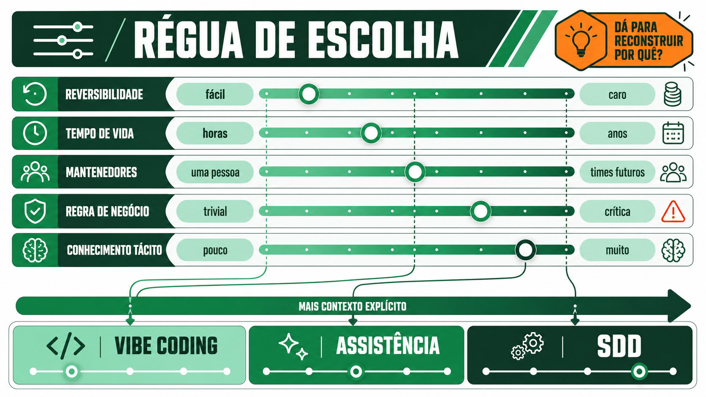

# Padrões e decisões

## Quando cada modo se justifica

Os três modos de [Conceitos](conceitos.md) não são degraus de maturidade que todo código precisa subir. São famílias de risco: a pergunta não é "qual modo é melhor", é "qual risco esta tarefa específica carrega".

| Critério | Favorece vibe coding | Favorece assistência de codificação | Favorece SDD |
|---|---|---|---|
| Reversibilidade | fácil de descartar | custo médio de retrabalho | difícil ou caro de desfazer |
| Tempo de vida esperado | horas, um experimento | semanas, uma feature | meses ou anos, parte do produto |
| Quantas pessoas vão mexer depois | só quem escreveu | o time atual | times futuros, sem contexto da decisão original |
| Regra de negócio envolvida | nenhuma, ou trivial | alguma, conhecida pelo time | crítica, com exceções que um prompt vago esquece |
| Familiaridade com o código existente | código novo, sem histórico | sistema conhecido pelo time atual | sistema grande e maduro, com convenções implícitas |

A pergunta que resume a tabela: se esse código quebrar em produção, alguém vai conseguir reconstruir por que ele foi escrito daquele jeito? Vibe coding não deixa rastro para responder. Assistência de codificação deixa o código e o ticket. SDD deixa a especificação inteira.

!!! tip "Aplique agora"
    Pense numa tarefa real do seu backlog desta semana. Percorra as cinco linhas da tabela e classifique-a: ela puxa para vibe coding, assistência ou SDD? Compare com a pessoa ao lado — vocês chegaram no mesmo modo para tarefas parecidas?

## Por que reversibilidade e tempo de vida pesam tanto

Boehm, em *Software Engineering Economics* (1981), documentou algo que antecede qualquer LLM: o custo de corrigir um defeito cresce a cada fase do desenvolvimento. Em sistemas pequenos, o crescimento é suave; em sistemas grandes e críticos, um problema descoberto depois da entrega pode custar da ordem de 100 vezes mais para corrigir do que o mesmo problema pego na fase de requisitos. A proporção exata varia por contexto (pesquisa mais recente questiona se o multiplicador de Boehm ainda vale em times ágeis com integração contínua), mas a direção não mudou em quatro décadas: quanto mais tarde uma ambiguidade aparece, mais caro fica resolvê-la.

É essa lógica que sustenta as duas primeiras linhas da tabela. Vibe coding empurra toda ambiguidade para depois, para quando o código já está em produção. SDD força a ambiguidade a aparecer antes, na especificação, onde ela ainda é barata de corrigir.

## O que a evidência empírica recomenda

A última linha da tabela não é intuição: vem do contraste entre os dois estudos de [Conceitos](conceitos.md#a-evidencia-empirica-ganhos-que-aparecem-e-ganhos-que-desaparecem). Peng et al. mediram ganho real numa tarefa nova e bem delimitada, sem histórico prévio: o cenário em que vibe coding ou assistência leve já entregam a maior parte do valor. O METR mediu perda real numa tarefa de manutenção, em sistema grande, com convenções que só existem na cabeça de quem já trabalha nele há anos. Nesse cenário, pular direto para vibe coding cobra caro, porque o tempo economizado na geração é gasto em dobro revisando uma proposta que ignorou contexto nunca explicitado.

A régua prática: quanto mais o problema depende de conhecimento tácito do sistema, maior a dose de especificação explícita que compensa.

## O princípio de simplicidade

A Anthropic, no guia de engenharia "Building Effective Agents" (dezembro de 2024), recomenda encontrar a solução mais simples possível, aumentando a complexidade apenas quando o problema exigir. Isso pode significar preferir um fluxo determinístico com uma ou duas chamadas ao modelo, mais simples que um agente autônomo. O guia distingue **workflows** (código orquestra o modelo em um caminho predefinido) de **agentes** (o modelo decide dinamicamente os próprios passos), e cataloga cinco padrões de workflow antes de recomendar autonomia plena:

- **Encadeamento de prompts.** A saída de uma chamada vira a entrada da próxima, numa sequência fixa.
- **Roteamento.** Uma primeira chamada classifica o pedido e direciona para o caminho especializado certo.
- **Paralelização.** Várias chamadas rodam ao mesmo tempo sobre partes independentes do problema, e os resultados se combinam no final.
- **Orquestrador-trabalhadores.** Uma chamada central decompõe a tarefa e distribui pedaços para outras chamadas especializadas.
- **Avaliador-otimizador.** Uma chamada gera, outra critica o resultado contra um critério definido, e o ciclo repete até passar.

O mesmo princípio vale para a escolha entre vibe coding, assistência e SDD: comece pelo modo mais simples que a linha da tabela permitir, e suba de nível só quando a tarefa concreta, não a vontade de usar a ferramenta mais avançada, exigir.

## Como avaliar modelos para engenharia de software

Escolher um modelo pelo nome mais falado do momento é o mesmo erro de raiz do vibe coding: aceitar sem verificar. Cinco critérios tornam essa escolha uma decisão, não uma torcida.

**Use um benchmark que meça o trabalho real, não a função isolada.** O HumanEval (Chen et al., 2021) mede se o modelo escreve uma função correta a partir de um enunciado — útil, mas distante do que a Sessão 8 chama de engenharia agêntica. O SWE-bench (Jimenez et al., 2024) mede se o agente resolve uma issue real de um repositório existente: localizar a causa, editar os arquivos certos, passar na suíte de testes da comunidade. É o benchmark mais próximo do que a Vetor precisa.

**Prefira o subconjunto verificado por humanos ao bruto.** O SWE-bench Verified é uma seleção de 500 instâncias revisadas manualmente quanto à solubilidade e à qualidade dos testes de aceitação — o SWE-bench "Full" original tinha instâncias irresolvíveis e testes instáveis. O "Lite" é uma versão mais fácil, útil para iteração rápida, não para decisão final.

**Desconfie de número saturado ou contaminado.** Em agosto de 2026, os modelos de fronteira no SWE-bench Verified estão a menos de um ponto percentual de diferença entre si — sinal de que o benchmark está perto da saturação para essa classe de modelo, e de que parte do ganho marginal pode vir de contaminação de treino (o repositório do benchmark é público). Quando os números empatam, o SWE-bench Pro (variante resistente a contaminação, com tarefas mais difíceis) costuma reordenar o ranking.

**Desconfie de número autorreportado por quem vende o modelo.** A própria OpenAI parou de reportar SWE-bench Verified para seus modelos mais recentes e passou a recomendar o SWE-bench Pro. O Google já divulgou, para o Gemini, um número de SWE-bench sensivelmente mais alto do que testes independentes padronizados reproduziram depois. Prefira leitores independentes (vals.ai, Epoch AI) que rodam todos os modelos sob o mesmo arnês, em vez do número que aparece no anúncio de lançamento.

**Nota da placar não é a decisão inteira.** Custo por tarefa resolvida, latência, tamanho da janela de contexto e confiabilidade dentro do seu ambiente agêntico específico pesam tanto quanto o resolve rate — um modelo 3 pontos percentuais à frente, mas 5 vezes mais caro por tarefa, raramente compensa para o dia a dia de um time.

### Placar de referência — SWE-bench Verified

| Modelo | Organização | Resolve rate |
|---|---|---|
| Claude Opus 5 | Anthropic | 97,0% |
| DeepSeek V4 Pro 0813 | DeepSeek | 96,4% |
| Kimi K3 | Moonshot AI | 93,4% |
| Claude Opus 4.8 | Anthropic | 88,6% |
| Grok 4.5 | xAI | 86,6% |
| Claude Sonnet 5 | Anthropic | 82,1% |
| Claude Haiku 4.5 | Anthropic | 73,3% |

Fonte: [vals.ai — SWE-bench Verified](https://www.vals.ai/benchmarks/swebench), snapshot de 19 de agosto de 2026, complementado com dados públicos de lançamento da Anthropic para Sonnet 5 e Haiku 4.5.

### E a família GPT-5.6 (Sol, Terra, Luna)?

Não entra na tabela acima por um motivo que já é a própria lição desta seção: a OpenAI, ao lançar o GPT-5.6 em três níveis (Sol, Terra, Luna) em julho de 2026, **não publicou nenhum número de SWE-bench Verified** para a família — só divulgou SWE-bench Pro, a variante mais difícil e resistente a contaminação:

| Modelo | Organização | SWE-bench Pro |
|---|---|---|
| Claude Fable 5 | Anthropic | 80,0% |
| Claude Opus 5 | Anthropic | 79,2% |
| GPT-5.6 Sol | OpenAI | 64,6% |
| GPT-5.6 Terra | OpenAI | 63,4% |
| GPT-5.6 Luna | OpenAI | não divulgado |

Colocar o Sol (64,6%) ao lado do Claude Opus 5 da tabela Verified (97,0%) seria comparar maçã com laranja: são benchmarks diferentes, com dificuldade diferente. É exatamente o tipo de comparação que o critério anterior (desconfiar do número que o próprio fabricante escolhe divulgar) existe para impedir. Quando um fabricante muda de benchmark de um lançamento para o outro, vale perguntar por que ele parou de reportar o benchmark anterior, não só por que o número novo parece mais baixo.

### Um benchmark que compara todo mundo pela mesma régua

A resposta para esse impasse não é desistir de comparar Claude e GPT: é procurar um benchmark que avalie os dois sob a mesma régua, na mesma data. O DeepSWE, da Datacurve, faz isso — 113 tarefas de longo horizonte, tiradas de 91 repositórios open source ativos em 5 linguagens, verificadas por programa, não por humano lendo o diff:

| Modelo | Organização | DeepSWE |
|---|---|---|
| Claude Opus 5 | Anthropic | 73,6% |
| GPT-5.6 Sol | OpenAI | 72,7% |
| Claude Fable 5 | Anthropic | 69,7% |
| GPT-5.6 Terra | OpenAI | 69,6% |
| GLM-5.3 | Z.AI | 69,0% |

Fonte: [benchlm.ai — DeepSWE](https://benchlm.ai/benchmarks/deepswe), atualizado em 20 de agosto de 2026, 25 modelos avaliados. Repare como a distância entre o primeiro e o quinto colocado (4,6 pontos) é bem menor do que a distância entre Sol e Terra no SWE-bench Pro: o ranking muda de cara dependendo de qual benchmark você escolhe, e nenhum dos dois é "o errado": medem coisas ligeiramente diferentes. A régua prática: quando precisar comparar fabricantes diferentes, procure primeiro um benchmark que avalie todos sob o mesmo teto antes de comparar números de tabelas separadas.

**Este placar envelhece rápido nas três tabelas**: confira a [SWE-bench Verified Leaderboard](https://www.swebench.com/), a [SWE-bench Pro Leaderboard](https://www.vals.ai/benchmarks/swebench) e o [DeepSWE Leaderboard](https://benchlm.ai/benchmarks/deepswe) atualizados antes de decidir, não confie em número congelado numa página de workshop.

## Anti-padrão: vibe coding tratado como produto

O anti-padrão não é usar vibe coding. É usar vibe coding e depois esquecer que foi usado. Os sintomas aparecem sempre na mesma ordem: o protótipo funciona na demonstração, alguém decide "já está pronto, só falta subir", ninguém escreve a especificação que existia apenas na cabeça de quem conversou com o agente, e o próximo bug custa uma investigação inteira porque não há teste, não há decisão registrada e não há ninguém que lembre por que aquele caso de borda foi ignorado.

A correção não é proibir vibe coding. É decidir o modo antes de começar, não depois que o protótipo já virou dependência de outras equipes.

**Próxima página:** [Exemplo arquitetural](exemplo-arquitetural.md) aplica esta tabela a um caso concreto.
