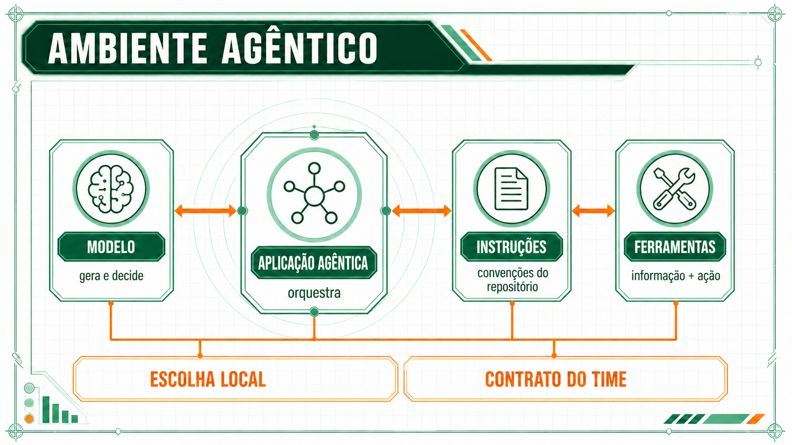
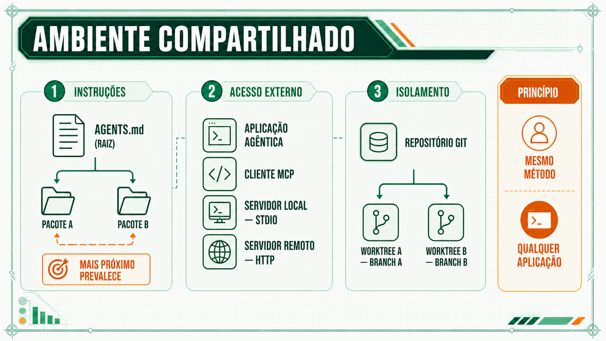
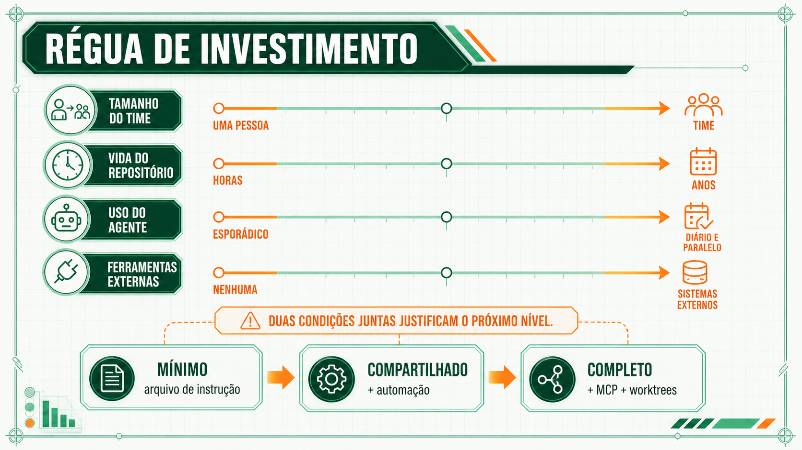

# O ambiente compartilhado

Um ambiente agêntico combina quatro peças. Quando cada desenvolvedor monta a combinação do próprio jeito, o que funciona numa máquina para de funcionar na do colega. Esta página mostra quais são as quatro peças e quando vale configurá-las em conjunto.

## O que forma um ambiente agêntico

Um ambiente agêntico é a combinação de quatro peças: o modelo, a aplicação agêntica que orquestra a conversa com ele (Claude Code, Codex CLI, Copilot, Cursor), o arquivo de configuração que carrega convenções do repositório, e o conjunto de ferramentas que o agente pode acionar. Quando cada desenvolvedor monta essa combinação do próprio jeito, o time cai no sintoma "ad hoc" descrito na Sessão 1: ninguém tem vocabulário comum para dizer o que configurar, e o resultado de um prompt numa máquina não se repete na do colega.

Para corrigir isso, compartilhe as três peças que independem da ferramenta escolhida: o arquivo de configuração, o protocolo de acesso a ferramentas externas e a disciplina de isolamento de contexto. Padronizar a aplicação agêntica para o time inteiro é uma decisão separada, que resolve outro problema.

## As quatro peças, lado a lado

| Peça | O que resolve | Compartilhado entre ferramentas? |
|---|---|---|
| Arquivo de configuração (AGENTS.md / CLAUDE.md) | O agente conhece as convenções do repositório | Sim. Mesmo arquivo, qualquer agente que o leia |
| MCP | O agente acessa uma ferramenta externa sem integração específica | Sim. Protocolo aberto, adotado por múltiplos fornecedores |
| Isolamento por ramo (worktree) | Duas sessões não corrompem o trabalho uma da outra | Sim. É uma prática de git, que independe da ferramenta de IA |
| Aplicação agêntica (Claude Code, Copilot, Cursor) | Orquestra a conversa entre humano, modelo e ferramentas | Não. Cada equipe escolhe a própria, o método é agnóstico |

!!! question "Antes de continuar"
    Das quatro peças da tabela, qual o seu time já tem hoje? Qual está completamente ausente?

## Quando vale configurar um ambiente compartilhado

Montar um arquivo de instrução, conectar uma ferramenta via MCP e isolar contexto por ramo tem custo de configuração. Vale a pena quando pelo menos duas condições aparecem juntas:

| Critério | Baixo investimento suficiente | Investimento completo justificado |
|---|---|---|
| Tamanho do time | uma pessoa | mais de uma pessoa usando agente no mesmo repositório |
| Vida do repositório | protótipo descartável | projeto que vai durar meses ou anos |
| Frequência de uso do agente | esporádica | diária, múltiplas sessões em paralelo |
| Ferramentas externas necessárias | nenhuma, só leitura/escrita de arquivo | acesso a banco de dados, API interna, rastreador de tarefas |

Num repositório pessoal, de uso esporádico, um arquivo de instrução simples já entrega a maior parte do ganho, sem MCP e sem worktree. Um time de vários desenvolvedores usando agente todo dia num sistema de produção cai do lado direito nas quatro linhas da tabela.

A conta é a mesma de qualquer investimento em preparação. Você paga o custo de configurar agora, de uma vez, e recebe o ganho depois, espalhado por cada sessão futura de agente. Numa tarefa esporádica esse ganho futuro não cobre o custo presente. Num repositório que o time usa todo dia, cobre rápido: já na segunda sessão o agente reaproveita o mesmo arquivo de instrução, a mesma conexão MCP e o mesmo hábito de isolar por ramo, sem reconfigurar nada.

!!! tip "Aplique agora"
    Classifique o repositório em que você mais usa IA hoje contra as quatro linhas da tabela. Ele pede o ambiente completo, ou um arquivo de instrução simples já resolveria a maior parte do problema?

**Próxima página:** [O arnês do agente](arnes.md).
