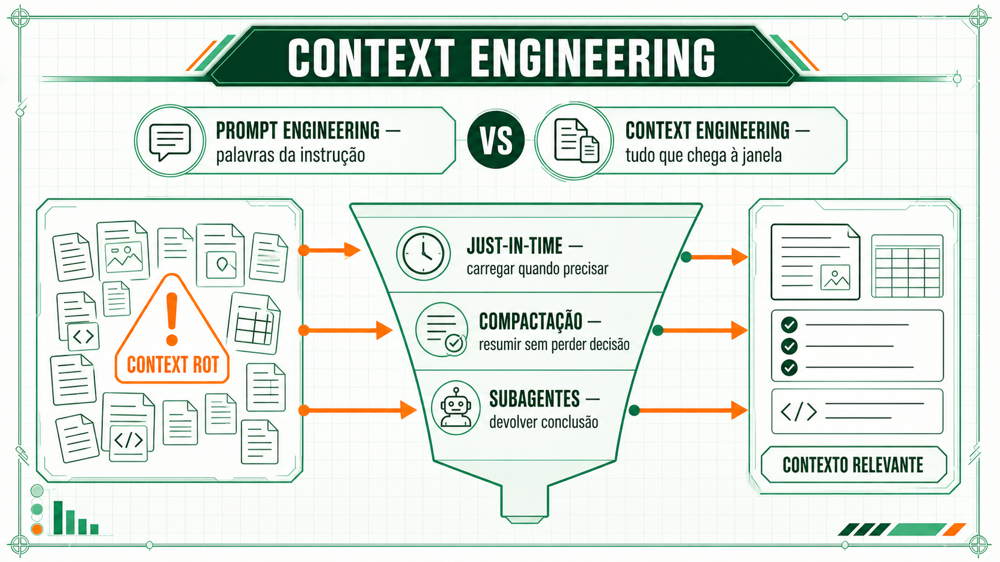

# Engenharia de contexto

Preparar o que entra na janela de contexto de um agente deixou de caber na ideia de engenharia de prompt. A mudança de escopo, e o que ela implica para quem configura o ambiente do time.

A [Anthropic, no guia de engenharia "Effective context engineering for AI agents"](../referencia/bibliografia.md#anthropic-effective-context-engineering-2025) (setembro de 2025), descreve uma virada de foco: depois de alguns anos em que a engenharia de prompt (*prompt engineering*, encontrar as palavras certas para uma instrução) dominava a atenção, o problema real passou a ser outro: qual configuração de contexto tem mais chance de produzir o comportamento desejado do modelo. A engenharia de prompt cuida do texto da instrução. A engenharia de contexto (*context engineering*) cuida de tudo que chega à janela de contexto numa execução: instruções, histórico, resultados de ferramentas, arquivos lidos.

O guia é específico sobre o papel das ferramentas nessa mudança: elas são o contrato entre o agente e o espaço de informação e ação disponível, e precisam ser desenhadas para eficiência de token e para induzir comportamento eficiente do agente. Uma ferramenta mal desenhada consome espaço de contexto que poderia ir para informação relevante ao problema, além de ser mais incômoda de usar.

A engenharia de contexto virou o problema central, e não só mais uma etapa da engenharia de prompt, por um motivo técnico presente na própria arquitetura Transformer, apresentada por [Vaswani et al. (2017)](../referencia/bibliografia.md#vaswani-et-al-attention-is-all-you-need-2017) e já citada na Sessão 1: a atenção entre tokens cresce de forma quadrática com o tamanho do contexto. Quanto mais token na janela, mais relações de atenção o modelo precisa distribuir entre eles, e sua capacidade de recuperar com precisão uma informação específica cai de forma gradual conforme o contexto cresce — efeito que a própria Anthropic chama de degradação de contexto (*context rot*).

O guia recomenda duas técnicas concretas contra essa degradação. A primeira é recuperação just-in-time: em vez de pré-carregar todo dado relevante antes de começar, o agente mantém referências leves (caminho de arquivo, consulta salva, link) e usa ferramentas para carregar o conteúdo completo só no momento em que precisa dele. O Claude Code opera assim: escreve uma consulta direcionada e usa ferramentas de linha de comando para vasculhar uma base de código inteira sem carregar cada arquivo na janela de contexto de uma vez. A segunda é compactação: numa tarefa de muitas etapas, o agente resume o histórico de conversa com alta fidelidade antes de continuar, mantendo o que importa. A régua de qualidade é maximizar primeiro o que a compactação lembra, e só depois cortar o que sobrou de irrelevante.

Uma terceira técnica separa o problema por arquitetura: sub-agentes com contexto isolado. Um agente principal delega uma exploração extensa, por exemplo varrer um repositório grande atrás da causa de um bug, para um sub-agente, que devolve um resumo condensado, muitas vezes na casa de 1 a 2 mil tokens. O agente principal recebe só a conclusão da investigação.

O mesmo raciocínio vale para a instrução que configura o agente, seja um prompt de sistema ou um arquivo como o AGENTS.md discutido adiante: o guia chama de altitude certa o ponto de equilíbrio entre instrução específica demais, que quebra assim que a tarefa foge um pouco do previsto, e instrução genérica demais, que não muda decisão nenhuma. Uma instrução na altitude certa é específica o bastante para guiar o comportamento, e flexível o bastante para deixar o modelo aplicar critério nos casos que ela não previu.

**Próxima página:** [MCP e ferramentas externas](mcp.md).
