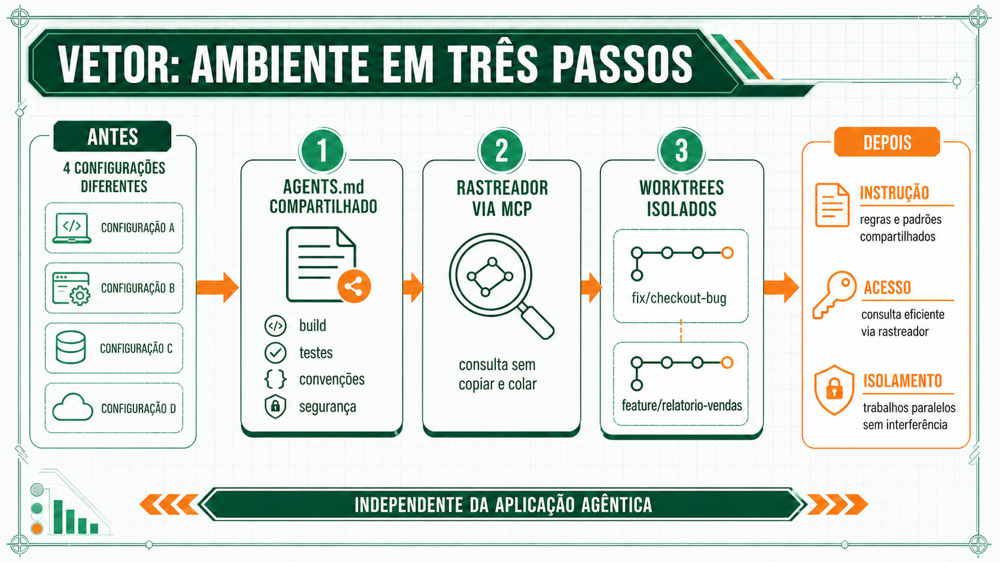

# Exemplo arquitetural: o ambiente da Vetor

Este exemplo é uma demonstração conduzida pelo instrutor, não um exercício. O objetivo é ver, do zero, as três peças compartilhadas de um ambiente agêntico sendo montadas para um repositório real.

**A Vetor**, usada como caso em toda esta sessão, é uma plataforma fictícia de e-commerce B2B que atende clientes padrão e atacado. Hoje, os quatro desenvolvedores do time usam agentes configurados de formas diferentes: dois têm um `CLAUDE.md` pessoal e desatualizado, um não tem arquivo nenhum, e nenhum deles conecta o agente ao rastreador de tarefas da empresa.

## Passo 1 — Um arquivo de instrução compartilhado

O time da Vetor escreve, em conjunto, um único `AGENTS.md` na raiz do repositório:

```markdown
# AGENTS.md — Vetor

## Build e testes
- Build: `npm run build`
- Testes: `npm test` (Jest)
- Nunca commitar sem rodar `npm run lint` antes

## Convenções
- Nomes de variáveis e funções em português, alinhado ao domínio do negócio
- Tipos de cliente: sempre "padrao" ou "atacado" (sem acento, minúsculo) — é o valor usado no banco

## Segurança
- Nunca imprimir a chave de API do gateway de pagamento em log
```

Repare no que ficou de fora: nenhuma explicação de arquitetura histórica, nenhuma boa intenção genérica como "escreva código limpo". Cada linha muda um comportamento concreto que o agente tomaria de forma diferente sem essa informação — principalmente a convenção de tipo de cliente, que já causou um bug de comparação de string no passado.

## Passo 2 — Uma ferramenta conectada via MCP

A Vetor conecta o agente ao rastreador de tarefas da empresa por um servidor MCP. Antes disso, perguntar uma tarefa em aberto exigia copiar e colar manualmente o texto da tarefa no prompt. Depois de conectado, o agente consulta o rastreador diretamente: "quais tarefas estão atribuídas a mim no momento" vira uma pergunta que o agente responde sozinho, sem que o desenvolvedor precise sair do editor.

## Passo 3 — Isolamento por ramo

Dois desenvolvedores da Vetor, na mesma tarde, precisam usar o agente em paralelo: um corrigindo um bug na tela de checkout, outro adicionando um relatório novo. Em vez de os dois trabalharem no mesmo diretório, cada um cria um worktree:

```bash
git worktree add ../vetor-fix-checkout fix/checkout-bug
git worktree add ../vetor-relatorio feature/relatorio-vendas
```

Cada agente roda no próprio diretório, na própria branch, sem risco de um sobrescrever a edição do outro enquanto os dois trabalham ao mesmo tempo.



## Leitura do exemplo

Nenhuma das três peças exigiu escolher uma ferramenta de IA específica. O `AGENTS.md` é lido por qualquer agente de codificação compatível com o padrão; o MCP é um protocolo aberto; o worktree é um recurso do próprio git. É exatamente o ponto da Sessão 2: o ambiente compartilhado não depende de a equipe concordar sobre qual ferramenta usar.

**Próxima página:** [Estudo de caso](estudo-de-caso.md).
