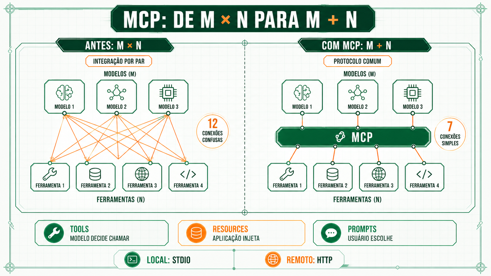
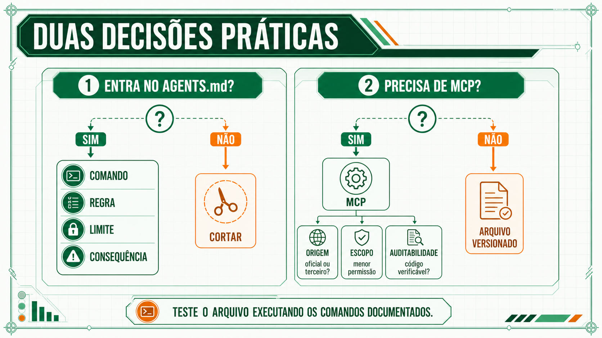

# MCP e ferramentas externas

O Model Context Protocol (MCP) é o padrão aberto que dá ao agente acesso a uma ferramenta externa sem exigir uma integração específica por par ferramenta-agente. O problema que ele resolve, suas três primitivas, e os critérios para conectar um servidor.

## O problema M×N e o Model Context Protocol

Antes de novembro de 2024, conectar um agente a uma ferramenta externa (um banco de dados, um rastreador de tarefas, um sistema de arquivos) exigia uma integração específica para aquele par modelo-ferramenta. Com M modelos e N ferramentas, o time enfrentava M×N integrações para manter.

A [Anthropic abriu o código do Model Context Protocol (MCP)](../referencia/bibliografia.md#anthropic-introducing-the-model-context-protocol-2024) para resolver exatamente essa conta: um protocolo aberto no qual cada modelo implementa o MCP uma vez, e cada ferramenta ou serviço implementa o MCP uma vez. A multiplicação vira soma. Um ano depois do lançamento, o protocolo já tinha adoção de OpenAI, Google e Microsoft, tornando-se o padrão de fato para conectar agentes a sistemas externos. A adoção veio do problema de manutenção que todo fornecedor já tinha, sem imposição de nenhuma empresa.

O protocolo formaliza essa integração numa arquitetura cliente-servidor: a aplicação agêntica mantém um cliente MCP para cada servidor a que se conecta, e cada servidor expõe suas capacidades por três primitivas independentes. *Tools* são funções que o próprio modelo decide quando chamar, como consultar um rastreador de tarefas. *Resources* são dados que a aplicação injeta no contexto por conta própria, como o conteúdo de um arquivo específico. *Prompts* são modelos de instrução prontos, escolhidos por quem usa a ferramenta, não pelo modelo. Um servidor não precisa expor as três. A maioria expõe só *tools*.

O protocolo também define como a aplicação agêntica fala com cada servidor. Um servidor local, que roda como processo na mesma máquina do agente, se comunica por *stdio* (entrada e saída padrão do processo). Um servidor remoto, acessado pela rede e compartilhado por várias pessoas ao mesmo tempo, usa HTTP com *streaming*. A escolha de transporte não muda o que o servidor expõe, só como a aplicação agêntica conversa com ele. Servidor de uso individual costuma rodar em *stdio*, e servidor de uso compartilhado pelo time inteiro tende a rodar como serviço HTTP.



Na prática, conectar um servidor MCP a uma aplicação agêntica como o Claude Code ou o Cursor é uma questão de configuração, não de código novo:

```json
{
  "mcpServers": {
    "rastreador-de-tarefas": {
      "command": "npx",
      "args": ["-y", "@exemplo/mcp-server-tarefas"],
      "env": {
        "API_TOKEN": "..."
      }
    }
  }
}
```

A aplicação agêntica lê essa configuração, inicia o processo do servidor e passa a oferecer as ferramentas que ele expõe como parte do conjunto disponível ao modelo. O `AGENTS.md` do repositório não precisa mudar uma linha para isso funcionar. As duas peças são independentes.

## Quando conectar uma ferramenta externa

Conectar uma ferramenta via MCP tem sentido quando o agente precisa de informação ou de capacidade de ação que não existe no próprio código do repositório: consultar o estado atual de um banco de dados, abrir um chamado num rastreador, buscar a versão vigente de uma política num sistema externo. Informação que já cabe num arquivo do repositório dispensa o protocolo, porque o próprio agente lê o arquivo diretamente.

A pergunta que resume a decisão: essa informação muda independentemente do código, num sistema que o agente não teria como acessar de outra forma? Se sim, MCP. Se a informação já está versionada no repositório, um MCP é complexidade desnecessária.

As três primitivas do protocolo, vistas em [MCP e ferramentas externas](mcp.md#o-problema-mn-e-o-model-context-protocol), ajudam a decidir que tipo de acesso pedir, não só se vale conectar. Se o agente precisa decidir sozinho quando buscar a informação, ela deveria chegar como *tool*. Se a informação é sempre necessária, e não depende de decisão do agente, faz mais sentido a aplicação injetar como *resource*, sem gastar uma chamada de ferramenta para buscar algo que já era certo que ia ser usado.

Existe um segundo motivo para conectar menos do que a vontade pede. Cada ferramenta a mais amplia o espaço de decisão de cada etapa do agente, e o catálogo consome janela de contexto antes de qualquer pedido, então catálogo mínimo é decisão de qualidade e de custo ao mesmo tempo. A evidência que sustenta isso, incluindo o caso da Vercel, está em [O arnês do agente](arnes.md#mais-ferramentas-nao-significa-menos-erro).

!!! tip "Aplique agora"
    Antes de conectar o próximo servidor MCP no seu ambiente, confira a origem: é mantido pelo fornecedor oficial da ferramenta, ou por um terceiro sem relação com quem construiu o sistema que ele acessa? Servidor de terceiro não é proibido, mas pede leitura do código, se for aberto, e o menor escopo de permissão que a tarefa permitir.

## Avaliar a origem do servidor MCP

Um servidor MCP roda como um processo à parte, com acesso ao que você autorizar: um banco de dados, um sistema de arquivos, uma API interna. Três critérios reduzem o risco de conectar algo que expõe mais do que deveria:

- **Origem.** Servidor mantido pelo próprio fornecedor da ferramenta (o rastreador de tarefas, o banco de dados) tem manutenção e segurança verificadas por quem construiu o sistema de origem. Servidor de terceiro, sem essa relação, pede mais cautela antes de conectar.
- **Escopo.** Peça o menor conjunto de permissões que a tarefa exige. Um servidor de banco de dados com acesso só de leitura remove uma categoria inteira de risco, mesmo quando o acesso de escrita está disponível.
- **Auditabilidade.** Se o servidor é de código aberto, alguém do time já leu o código antes de conectar em produção? Um servidor fechado, sem essa possibilidade, exige mais confiança na origem para compensar.



**Próxima página:** [O arquivo de instrução](arquivo-de-instrucao.md).
